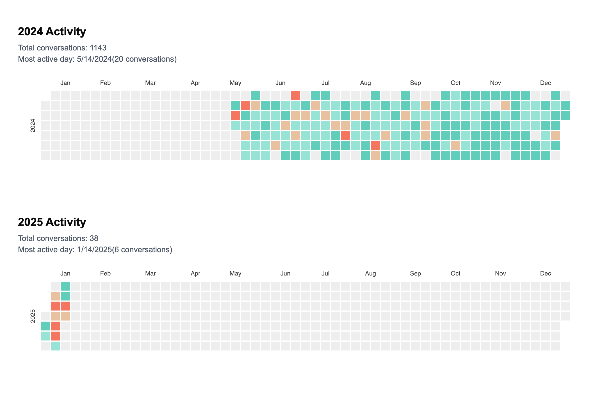

# AI Conversation Heatmap

Visualize all your ChatGPT conversations. Web implementation of [Chip Huyen's AI Heatmap Jupyter notebook](https://github.com/chiphuyen/aie-book/blob/main/scripts/ai-heatmap.ipynb).

🔗 **Live Demo**: [aiheatmap.dennisamz.com](https://aiheatmap.dennisamz.com)

It's super simple. Upload your conversations and a heatmap of all your convos over time gets generated. All data processing happens in browser and no data gets stored, meaning all your convos remain private. You can also export your heatmap as an image.

## Preview

## Usage

1. Go to ChatGPT Settings > Data controls > Export
2. Extract the downloaded zip file
3. Upload the `conversations.json` file to generate your heatmap
